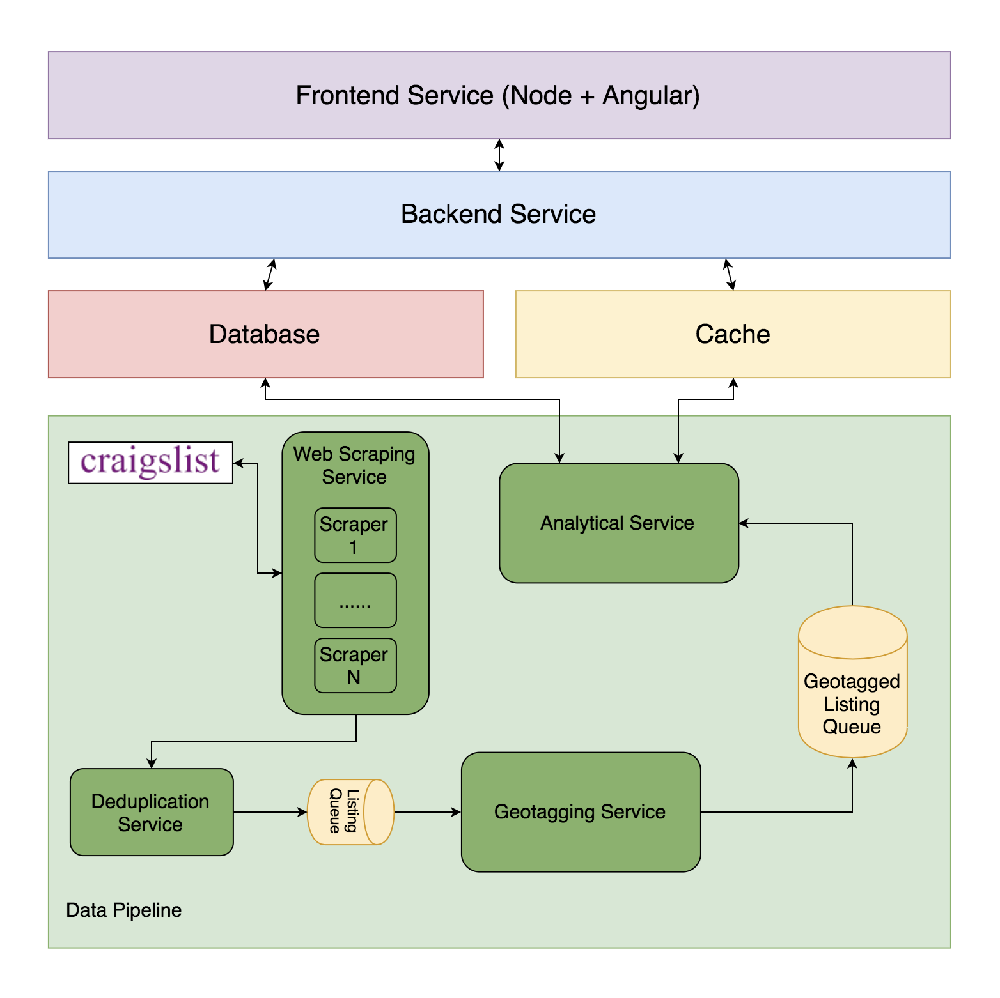

# Design Document

## Overview

This document will discuss the high-level design, modularization, interactions between modules, and reasonings on design choices of the Housing Market Monitoring System.

The core of the Housing Market Monitoring System are:

1. Web scrapers which continuously collect housing listings from Craigslist, where each scraper focus on one subsite (e.g. orangecounty.craigslist.org).

1. Duplicates elimination services

1. Geotagging services

1. Analytical services

1. A database that stores all the listings and the analytical results for each subsite

1. A map based visuliazation application

## Main use cases

* Visualize (medium, average...) housing prices of different regions

* Display newest listings in a particular region

* (Future) Display pricing history

* (Future) Notify users about new listings

* (Future) Predict price changes

## High level design diagram

## Detailed design

## Future work

