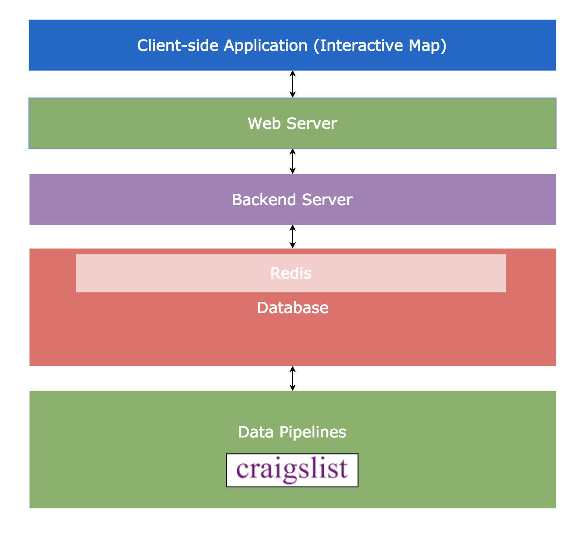
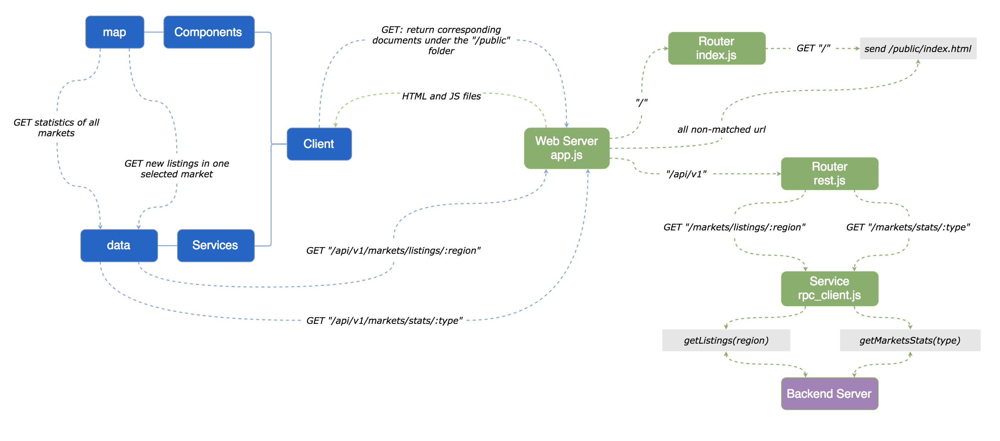
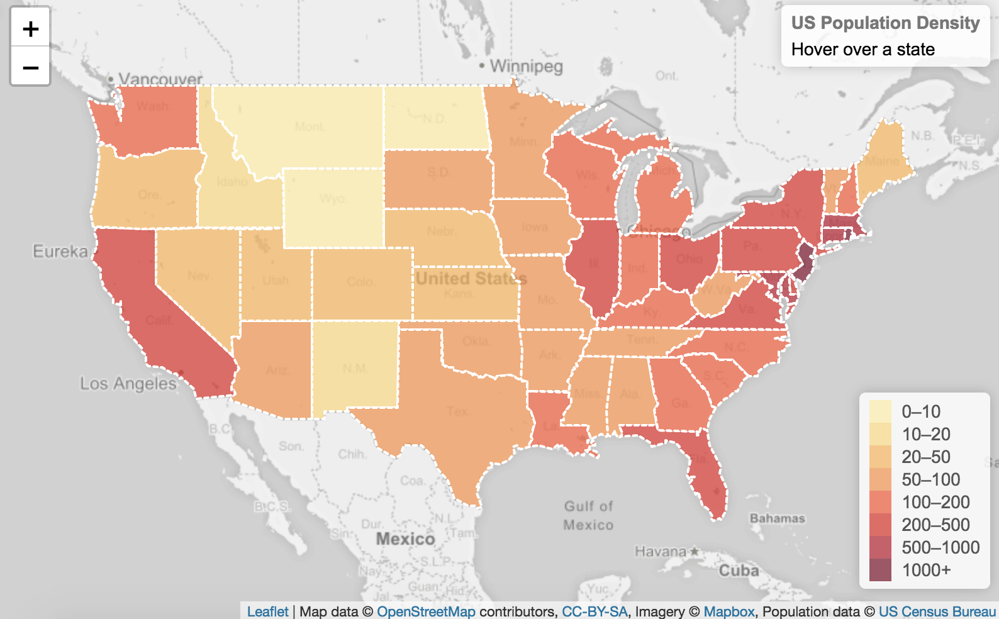
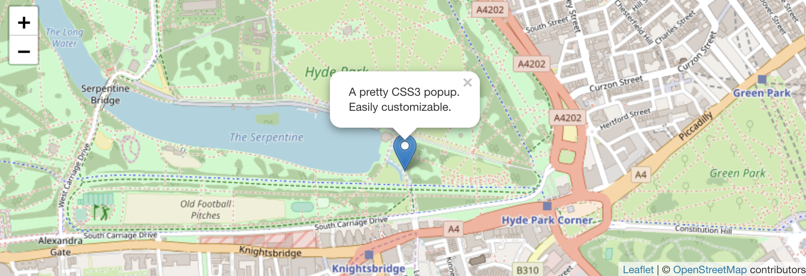
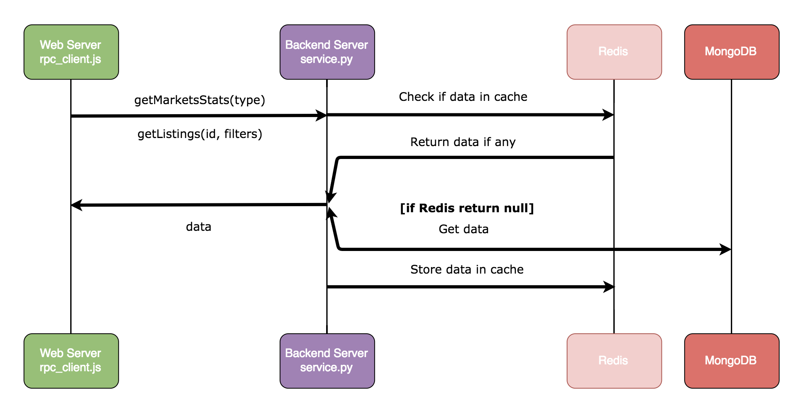
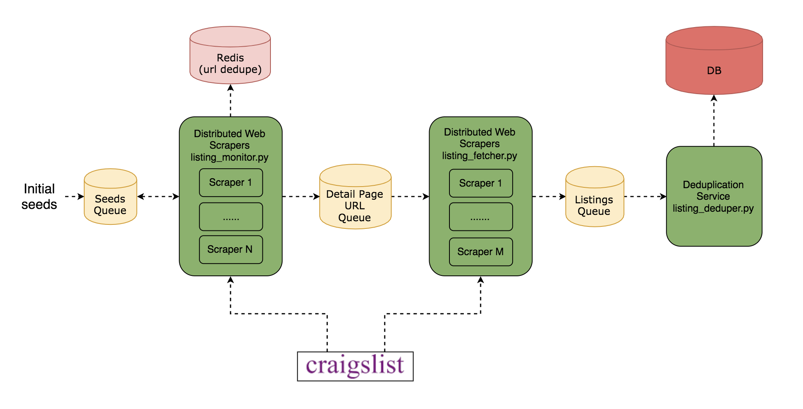

# Design Document

## Overview

This document will discuss the high-level design, modularization, interactions between modules, and reasonings on design choices of the Housing Market Monitoring System.

Core components:

1. A map based visualization application.
1. Web servers that handle client's requests.
1. Backend servers that communicate with the database.
1. Database with a cache layer that stores and serves housing data.
1. Data pipelines that continuously scrape housing listings and ingest them into the database.

## Main use cases

* Visualize average housing prices of different regions.
* Display newest housing listings in a particular region.

## High level design diagram

## Detailed design

### Modules Design: Web Servers

Design Choices | Reasons
--- | ---
Leaflet | 1. Open source, plenty of plugins, good documentation, and free.   2. Same performance and functionalities compared to its main competitor, Google Maps JavaScript API ([see comparisons here](https://www.codementor.io/victorgerardtemprano/google-maps-api-or-leaflet--what-s-best-for-your-project-faaev60vm)).
Angular | 1. Performance, communicate with servers using JSON.   2. A complete client-side MVC framework, which is better than React at handling complex logic.  
Node.js | 1. Performance, non-blocking I/O (since this system relies heavily on database I/O), single threaded and event loop.   2. JavaScript, same language used in the client-side app.
RESTful API | 1. APIs open to the clients are mostly CRUD ([understand REST and RPC for HTTP APIs](https://www.smashingmagazine.com/2016/09/understanding-rest-and-rpc-for-http-apis/)).   2. A standardized way to model resources on the server, e.g. GET "/api/v1/markets/:id/listings" use it with query strings will allow for easy evolution of this API such as fetching listings with different attributes.

* UI design 1: average prices of all the markets (Regions are shaded in proportion to the measurement of the statistical variables)

* UI design 2: new listings in one selected region

### Modules Design: Backend Servers

Design Choices | Reasons
--- | ---
SOA/[Decoupling](https://www.cloudamqp.com/blog/2016-10-12-why-is-application-decoupling-a-good-thing.html) | 1. Easier to maintain code and change implementations as different parts of the system can evolve independently.   2. Cross-platform, different languages and technologies.   3. Independent releases.
RPC | 1. Backend APIs are used internally, so the "client" can be updated accordingly when the server's APIs change.   2. Evolvability, allows for future action-based APIs (e.g. send scraping commands to refresh the listings)
Python | 1. Maintainability, scalability, clean platform, more standardized than Node.js, good for bigger and more complex projects [see comparisons here](https://www.agriya.com/blog/2016/07/13/nodejs-vs-python-where-to-use-and-where-not/).   2. Code reuse, same language used in the data pipelines.
Redis | 1. Performance, caching, flexible, in-memory key value data structure store, and reliable, persistence to disk.   2. Better than memcached, more scalable, handle heavy reads and writes, [see more here](https://www.linkedin.com/pulse/memcached-vs-redis-which-one-pick-ranjeet-vimal/), and [here](https://stackoverflow.com/questions/10558465/memcached-vs-redis)
MongoDB | 1. More scalable than RDBMS, dynamic schemas, data locality, [see more here](https://www.mongodb.com/compare/mongodb-mysql?jmp=docs)   2. No complex transactions needed.   3. JSON-like documents, friendly to JavaScript

### Modules Design Data Pipelines

Design Choices | Reasons
--- | ---
(1) listing_monitor.py: Scrape url and time in the search page. Use redis to prevent scraping same contents again.   (2) scraper_scheduler.py: communicates with the task queue and distribute tasks to contents scrapers.   (3) listing_fetcher.py: scrape id, prices, geo, title, name, and any other useful information   (4) listing_deduper.py: if a listing is recently posted, update it, if it exceeds the TIME_INTERVAL_THRESHOLD, create a new data entry. | 1. When a listing is updated, its url stays the same, but its time is changed to the time when the update occurs. Store url concatenated with time as key, set expire time to 45 days as by default Craigslist only keep listings for 45 days.   2. Organizer of the distributed scraper cluster, prevent multiple scrapers from doing the same work.   3. Fetch detailed information about a listing. Since geo data only exists in the contents page and contents page has everything that is on the search page, contents scraping should be done inside the contents page.   4. new data: insert; same listing with different Craigslist id/url: update, same listing exceeding the TIME_INTERVAL_THRESHOLD: insert
SOA/[Decoupling](https://www.cloudamqp.com/blog/2016-10-12-why-is-application-decoupling-a-good-thing.html) | 1. Easier to maintain code and change implementations as different parts of the system can evolve independently.   2. Cross-platform, different languages and technologies.   3. Scale slower modules to resolve bottleneck.
Store each region's data in their own tables | 1. Structure the DB, make region-based queries faster.

## Future work

* Support different measurement of the statistical variables from average prices to median prices, etc.
* Add filters that can specify what to display in the new listings view.
* Rank new listings based on price/time/... and display the rank number on the marker
* Display (monthly) pricing history.
* Predict price changes.
* Look into Odata API