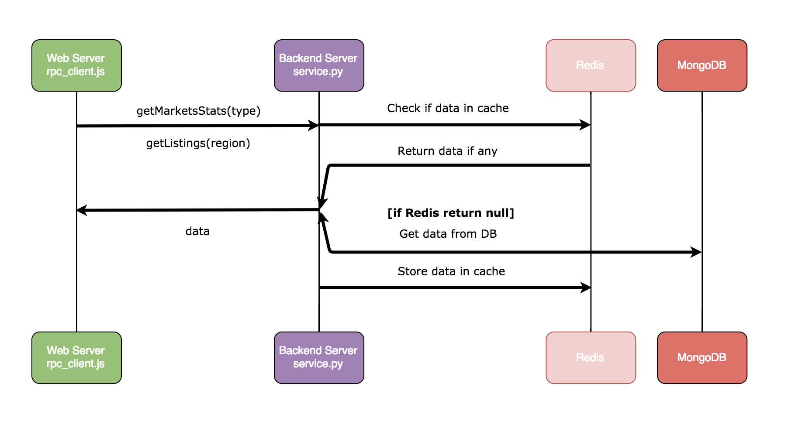

# Design Document

## Overview

This document will discuss the high-level design, modularization, interactions between modules, and reasonings on design choices of the Housing Market Monitoring System.

The core of the Housing Market Monitoring System are:

1. Web scrapers which continuously collect housing listings from Craigslist, where each scraper focus on one subsite (e.g. orangecounty.craigslist.org).

1. Duplicates elimination services

1. Geotagging services

1. Analytical services

1. A database that stores all the listings and the analytical results for each subsite

1. A map based visuliazation application

## Main use cases

* Visualize (mediam, average...) housing prices of different regions

* Display newest listings in a particular region

* (Future) Display pricing history

* (Future) Notify users about new listings

* (Future) Predict price changes

## High level design diagram

## Detailed design

### Modules Design Web Servers

Design Choices | Reasons
--- | ---
Leaflet | 1. Open source, plenty of plugins, good documentation, and free.   2. Same performance and functionalities compared to its main competitor, Google Maps JavaScript API ([see comparisons here](https://www.codementor.io/victorgerardtemprano/google-maps-api-or-leaflet--what-s-best-for-your-project-faaev60vm)).
Angular | 1. Perfomance, communicate with servers using JSON.   2. A complete client-side MVC framework, which is better than React at handling complex logic.  
Node.js | 1. Non-blocking I/O (since this system relies heavily on database I/O), single threaded and event loop.   2. JavaScript, same as the language used in the client-side app.
RESTful API | 1. API is mostly CRUD ([understand REST and RPC for HTTP APIs](https://www.smashingmagazine.com/2016/09/understanding-rest-and-rpc-for-http-apis/)).   2. A standardized way to model resources on the server, e.g. GET "/api/v1/markets/:id/listings" use it with query strings will allow for easy evolution of this API such as fetching listings with different attributes.

* UI example 1: average prices of all the markets (Regions are shaded in propotion to the measurement of the statistical variables)

* UI example 2: new listings in one selected region

### Modules Design Backend Servers

Design Choices | Reasons
--- | ---
SOA/[Decoupling](https://www.cloudamqp.com/blog/2016-10-12-why-is-application-decoupling-a-good-thing.html) | 1. Easier to maintain code and change implementations as different parts of the system can evolve independently.   2. Cross-platform, different languages and technologies.   3. Independent releases.
RPC | 1. Backend APIs are used internally, so developers have the control over the "client" when the server's API changes  
Python | vs Java, etc.
Redis | vs memcache or y cache at all
MongoDB | vs RDBMS

## Future work

